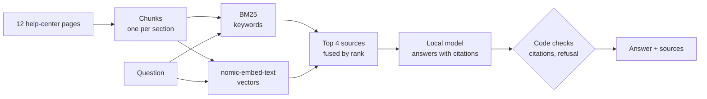

# rag-evals

[](https://github.com/joeljo2347-bit/rag-evals/actions/workflows/tests.yml)


Answers dentists' and practice staff's questions from a dental implant supplier's help center,
**with citations, or "I don't know"**, and an eval harness that measures how often that's right.
Retrieval, answering and scoring are all in plain Python; models run locally through Ollama.

```console
$ python -m ragkit.cli "We're a practice in Texas. When can we exchange implant sizes?"
[1] 0.032  Exchanges > Exchange windows
[2] 0.031  Implants and compatibility > Implant sizes
[3] 0.031  Warranty > Implant warranty
[4] 0.030  Implants and compatibility > Abutment compatibility

You can exchange implant sizes in March and September each year. This applies to all states
outside of California, including Texas.[1]
```
<sub>Real output from gpt-oss:20b, hybrid retrieval (scores are fused ranks). The sources never mention Texas; the model works it out from "all other states".</sub>

## Where this comes from

At AMII, a dental implant company, I build and run Noah, the company's AI assistant and ordering
platform. Doctors and staff ask it about products, ordering and company policy, and its answers
have to come from the company's own documents, not from the model's memory. This repo rebuilds
that idea from scratch on a made-up help center, with the evals that show whether it works;
AMII's code, documents and data stay private.

## Results

Two local models answered the same 40 questions (hybrid retrieval, top 4 sources).

**Graded blind** by a separate agent that saw only the help center, each question, the sources the
model was shown, and the answer. It had no expected answers, no model names, and opaque, shuffled
item ids, and was told to mark anything unstated or unhedged as wrong
([evals/blind/results.md](evals/blind/results.md)):

| Model | Correct | Answerable correct | Uncovered questions refused | Citations OK |
|---|---|---|---|---|
| gpt-oss:20b | 37/40 | 29/32 | 8/8 | 40/40 |
| qwen3:8b | 39/40 | 31/32 | 8/8 | 40/40 |

What it marked down: details the help center doesn't state ("within 7 days *of receipt*"), an added
justification ("for maintaining performance and safety"), and an unhedged inference ("yes, you can
still cancel" when packing only *usually* happens within 2 hours). No answer invented a policy or a
figure.

**Automatic checks**, fixed before any run ([evals/results.md](evals/results.md)): fact match
97% for both models, right source cited 100%, uncovered questions refused 100%, no false refusals.

**Retrieval** (answerable questions, section chunks):

| Retriever | hit@1 | hit@3 | MRR |
|---|---|---|---|
| BM25 | 91% | 100% | 0.95 |
| Dense (nomic-embed-text) | 88% | 91% | 0.89 |
| Hybrid (rank fusion) | 91% | 97% | 0.95 |

Fixed 40-word windows instead of sections cost 20–26 points of hit@1 for every retriever. BM25 and
dense miss different questions: "We're a practice in Texas" never matches a page that says "all
other states", and "if the replacement sizes cost more" pulls both toward "replacement drills".
Hybrid is the default because it recovers some of each; that choice was made on this same small
set.

## How it works



| Piece | Where |
|---|---|
| Chunking by section or by fixed word windows (to compare) | `ragkit/chunk.py` |
| BM25 with light stemming, dense retrieval, and hybrid by reciprocal rank fusion | `ragkit/retrieve.py` |
| Embeddings from Ollama, cached on disk; a hashing stand-in for tests | `ragkit/embed.py` |
| Answering: numbered sources in, citations parsed and checked by code | `ragkit/answer.py` |
| Scoring: hit@k, MRR, fact match, citation accuracy, refusals | `ragkit/metrics.py` |
| Eval runner, LLM judge, report | `evals/run.py` |
| HTTP API: `POST /ask` returns the answer and which sources it cited | `ragkit/api.py` |

## What the evals measure

The eval set (`evals/dataset.jsonl`) has 32 questions the help center answers, each with the
section that holds the answer and the facts a correct answer must contain, plus 8 it doesn't
cover, where the right answer is "I don't know".

- **Retrieval:** hit@1, hit@3 and MRR for each retriever and chunking strategy.
- **Correct:** every expected fact appears in the answer, after normalizing case, dashes and spacing.
- **Cites the right source:** at least one citation points at the section holding the answer.
- **Faithful (LLM judge):** a model reads the sources and the answer and says whether every claim
  is supported. By default the judge is gpt-oss:20b, the same model that answers in the first run,
  which is a known bias; pass `--judge` to use a different one.
- **Refusals:** says "I don't know" for uncovered questions, and doesn't for covered ones.

Per-question results, including every miss, are in `evals/runs/`.

## Run it

```bash
python3 -m venv .venv && .venv/bin/pip install -r requirements.txt -r requirements-dev.txt
.venv/bin/pytest -q                                   # no model needed
ollama pull nomic-embed-text && ollama pull gpt-oss:20b
.venv/bin/python -m ragkit.cli "How long can I keep a loaner surgical kit?"
.venv/bin/python -m evals.run --retrieval-only       # seconds
.venv/bin/python -m evals.run --models gpt-oss:20b,qwen3:8b
.venv/bin/uvicorn ragkit.api:app --port 8000         # POST /ask; docs at /docs
```

Point it at your own markdown with `RAG_CORPUS=/path/to/docs`: every `##` section becomes a chunk.

With Docker, and Ollama on the host:

```bash
docker build -t rag-evals .
docker run -p 8000:8000 rag-evals                       # Docker Desktop (Mac, Windows)
docker run -p 8000:8000 --add-host=host.docker.internal:host-gateway rag-evals   # Linux
```

On Linux, start Ollama with `OLLAMA_HOST=0.0.0.0`. The API embeds the documents when it starts, so
it needs Ollama running first; if it can't reach it, it stops with a message saying so.

## Limits

- 40 questions over 12 short pages is a small set: one question is about 3 points. It's enough
  to compare choices and catch regressions, not to promise an accuracy number on other data.
- Fact matching is string-based, so it can mark a right answer wrong when it's phrased in an
  unexpected way; misses are listed so they can be read, not just counted.
- The judge is a model too, and it can be wrong; its verdicts are reported separately.
- The help center and its company are made up.
